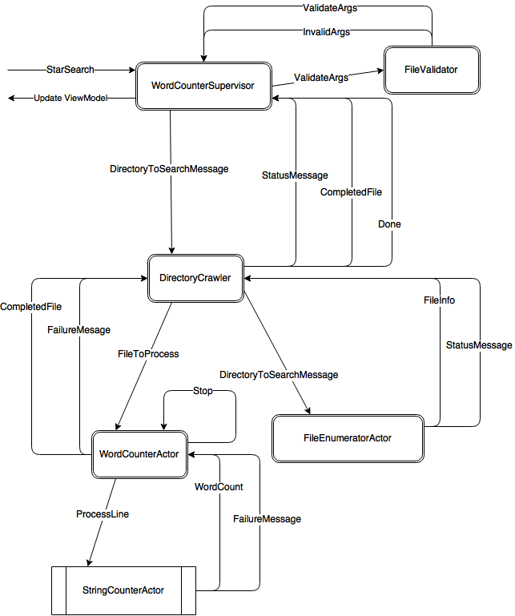

# Word Counter Application

Original sample code from [link](http://www.toptal.com/scala/concurrency-and-fault-tolerance-made-easy-an-intro-to-akka)

# Introduction

We are going to tackle the problem of counting the number of words contained in files. We will need a directory to start crawling and a search pattern to search for. This will only work on text files. Then for each directory and its children we will get the files that match the search pattern to count the number of words and display it in a grid.

The Main window consists of two textboxes, a button, and a Datagrid. The top textbox will have the directory to search, and the second textbox will will have the search pattern. The Count Button will start things off and the results will be displayed in the Datagrid.   

# Explaining the source code

We start with the `App.xaml.cs`, on the `OnStartup` method we create our [ActorSystem](<http://getakka.net/docs/concepts/actorsystem>) as a static member of the App class. that way we can always get to it by referencing the App class.

The `App.xaml` sets up the `StartupUri` to the `MainWindow.xaml` as the startup window. Then the MainWindow creates the `MainWindowViewModel` and sets it as its DataContext for binding purposes.

The `MainWindowViewModel` sets up the MainWindow by initializing some property members to default values, creates the command for the button, creates a [Subject](<http://www.introtorx.com/content/v1.0.10621.0/02_KeyTypes.html>) that the actor will call on to add items to the Items [ReactiveList](<http://reactiveui.readthedocs.org/en/stable/basics/reactive-list/>), and finally will create the WordCounterSupervisor Actor that will start all the goodness of counting words.

When we click on the button on the MainWindow, we tell the WordCounterSupervisorActor to start the search.

## Message Flow Diagram

## Actors Involved

## WordCounterSupervisor

>This [actor](<http://getakka.net/docs/Working%20with%20actors>) supervises the request of counting the words for all files in the folder specified and its children.

It handles the following messages:

* **StartSearch**
  * Received from the `MainWindow` to initiate the search.
  * When received the Supervisor will send a message to the `FileValidator` actor to validate arguments. Mainly make sure that the directory exists.
 
* **ValidateArgs**
  * Received from the `FileValidator` actor if the arguments are valid.
  * If the arguments are valid then the supervisor will start crawling for files that meet the criteria, by sending a message to the `DirectoryCrawler` actor.
  
* **CompletedFile**
  * Received from the `DirectoryCrawler` every time a file has been processed.
  * It will use the `ViewModel` AddItem Subject to add an Item to the list.
  
* **StatusMessage**
  * Received from the `DirectoryCrawler` every time a file is picked up for processing.
  * Received from the `DirectoryCrawler` when we finish with all the file.

* **Done**
  * Received from the `DirectoryCrawler` when all files are processed.

## FileValidatorActor

>This [actor](<http://getakka.net/docs/Working%20with%20actors>) handles the validation of the arguments from the MainView. Specifically making sure the Directory exists.

It handles the following message:

* **ValidateArgs**
  * Received from the supervisor actor.

## DirectoryCrawlerActor

>This [actor](<http://getakka.net/docs/Working%20with%20actors>) handles the crawling of files, and passes the files to a `WordCounterActor` for processing. It creates the FileEnumeratorActor to enumerate the diretories. 

It handles the following messages:

* **DirectoryToSearchMessage**
  * Received from the Supervisor when arguments are valid and starts to process the files. It will create a `WordCounterActor` per file.

* **FileInfo**
  * Received from the `FileEnumeratorActor` when a file is found to meet the search criteria.
  
* **CompletedFile**
  * Received from the `WordCounterActor` to signal a counted file.

* **FailureMessage**
  * Receive from the `WordCounterActor` in case of any failure. 

* **Done**
  * Received from the `FileEnumeratorActor` when the directory enumeration is done.
  
  
## FileEnumeratorActor

>This [actor](<http://getakka.net/docs/Working%20with%20actors>) handles the enumeration for files in filesystem.

It handles the following message

* **DirectoryToSearchMessage**
  * Received from the `DirectoryCrawler` actor to start enumerating the files that meet the search criteria.

## WordCounterActor

>This [actor](<http://getakka.net/docs/Working%20with%20actors>) handles the reading of the file and counting the words.

It handles the following messages:

* **FileToProcess**
  * Received from the `DirectoryCrawler` actor to start processing the file.
  * It creates a [RoundRobinPool](<http://getakka.net/docs/working-with-actors/Routers#roundrobin>) of 8 `StringCounterActors` to process the file.    

* **WordCount**
  * Received from the `StringCounterActor` for every line containing the number of words in the line. It aggregates     the count until all the lines have been processed.
  * When the full file is read then it sends its parent a `CompletedFile` message with the statistics gathered.

* **FailureMessage**
  * Received from the `StringCounterActor` if there is a failure counting the line.

## StringCounterActor

>This [actor](<http://getakka.net/docs/Working%20with%20actors>) handles counting the words in a line.

It handles the following message:

* **LineToProcess**
  * Received from the `WordCounterActor` to process one line of text.
  * It counts the number of words in the line and sends back a `WordCount` message
